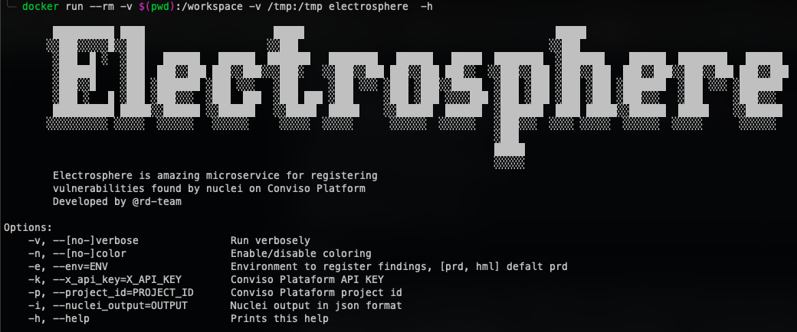
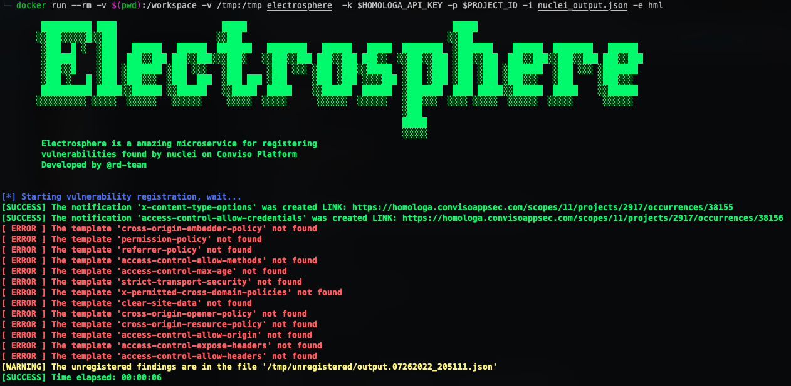

<p align="center" margin="20 0"><a href="https://github.com/convisolabs/electrosphere">
    </a></p>
    
<p align="center">
    <a href="/RELEASES" alt="version">
        </a>
    <a href="/LICENSE" alt="license">
        </a>
     </a>
</p>

# **About**
Electrosphere was built to help developers and security analysts who use the Conviso Platform to manage their vulnerabilities.

The purpose of this microservice is to register, in a simple and easy way, vulnerabilities found by nuclei on Conviso Platform. This application was Developed by rd-team.
<br>
<br>

## **About Conviso** 
[**Conviso**](https://www.convisoappsec.com/) is a SaaS company focused on application security with the purpose of empowering development professionals to build secure applications. For this, we created the Conviso Platform - a platform that supports the entire secure development cycle and is composed of five products:

[**Secure by Design**](https://www.convisoappsec.com/product#secure-by-design) -  Perform threat modeling and define requirements (ASRTM).

[**Secure Pipeline**](https://www.convisoappsec.com/product#secure-pipeline) - Bring dedup and Security Tools Orchestration into your pipeline (ASOC). 

[**Attack Surface**](https://www.convisoappsec.com/produto#attack-surface) - Identify, test, and monitor your External Attack Surface (EASM).

[**Protection as a Code**](https://www.convisoappsec.com/product#protection) - Developers are responsible for managing effective protections via WAF.

[**People & Culture**](https://www.convisoappsec.com/product#people-culture) - Empower your teams with the practice of code challenges contextualized and based on your team's main gaps.

[**Learn all that Conviso Platform can do for your company »**](https://www.convisoappsec.com/)
<br>
<br>

# **Getting started**

## **Requirements**

- Docker
You need Docker installed in your machine in order to run Electrosphere.

## **Installing Electrosphere**

### Clone repository
	
```bash
  git clone https://github.com/convisolabs/electrosphere.git 
  cd electrosphere
```

### Build docker image
	
```bash
  docker build -t electrosphere .
```

## **Usage**

### **CLI Usage**
Electrosphere uses the nuclei output in JSONL(ines) format to register vulnerabilities in the Conviso Platform.

To generate the output correctly use the following command:

```bash
  nuclei -u $HOST -t $TEMPLATE -json -irr -o nuclei_output.json
```

Important: `Do not change or format the nuclei output`

### **Options**

```bash
  docker run --rm -v $(pwd):/workspace -v /tmp:/tmp electrosphere  -h
```


### **Demos**

Demo running in homologation environment
	
```bash
  docker run --rm -v $(pwd):/workspace -v /tmp:/tmp electrosphere  -k $X_API_KEY -p $PROJECT_ID -i nuclei_output.json -e hml
```


---
<br>

## **Documentation**

You can find Conviso Platform's documentation on our [**website**](https://docs.convisoappsec.com/).
<br>
<br>
## **Contributing**
Contributing to open source is more than just providing updates, it's also about letting us know when there is an issue. Read our [**Contributing Guidance**](/CONTRIBUTING.md) to learn more.

We accept different types of contributions, including some that don't require you to write a single line of code.
<br>
<br>
 
## **Security**
For any security issues or concerns, please see our [**Security Policies**](/SECURITY.md) file in this repository.
<br>
<br>
 
## **Help and support**
Your help and feedback is always welcome! If you find an issue let us know, either by clicking the Create Issue on any of the website pages, or by directly opening an issue here in the repo.

You can connect with us and other contributors through the [**DevSecOps Community**](https://discord.com/invite/7KDTNvGUPN) on Discord. You're welcome!
<br>
<br>
 
## **License**
This work is licensed under the [**MIT License**](LICENSE).
<br>
<br>
 
## **And that 's it!**
Thanks for all your contributions and efforts towards improving this work. We thank you for being part of our community!
